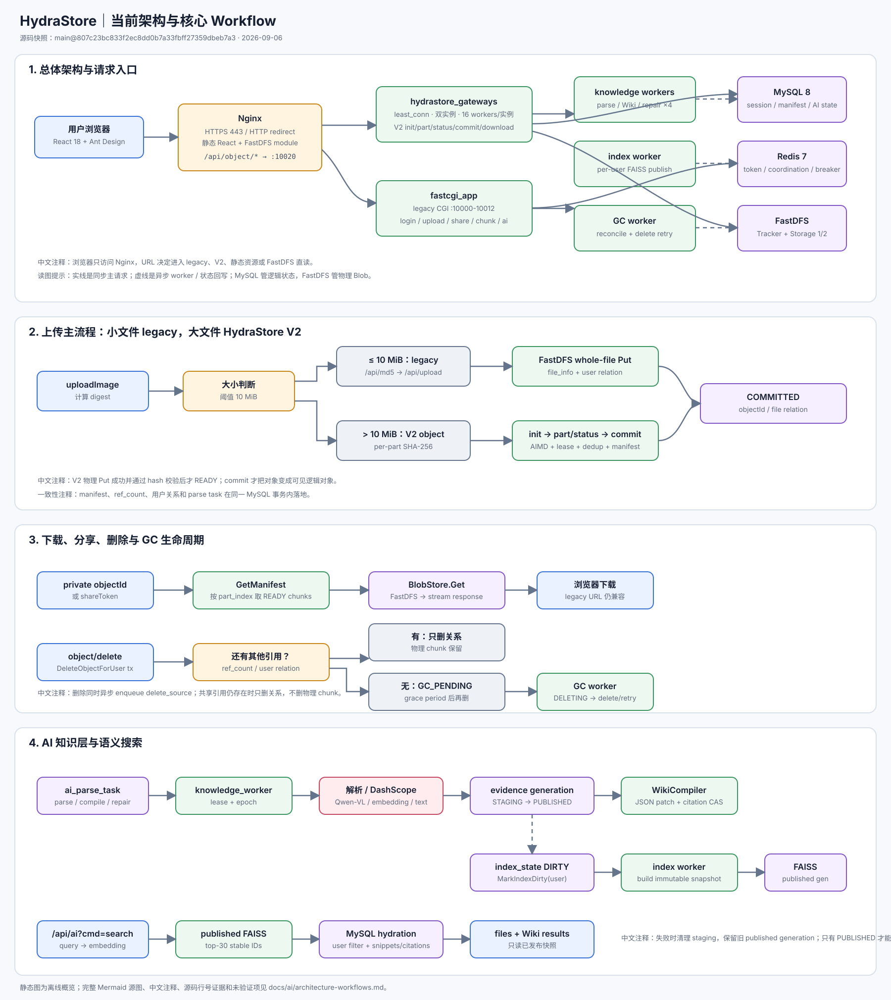

# HydraStore｜高性能分布式对象存储系统

> 当前仓库是一个基于 Docker Compose 的私有云对象存储系统，兼容 legacy 文件链路，同时提供 HydraStore V2 分片对象存储、共享下载、延迟 GC 和 AI 知识检索。
>
> 架构说明以当前源码、Compose、SQL migration 和前端服务层为准。旧版 chunked_upload.md 中的 Appender 合并属于兼容链路，不是当前前端大文件上传的主路径。

- [完整架构与 Workflow 文档](docs/ai/architecture-workflows.md)
- [交互式 HTML 图集](reports/architecture/hydrastore-current/architecture-workflows.html)
- [可追溯 JSON 证据索引](reports/architecture/hydrastore-current/architecture-workflows.json)

## 项目能力

- 用户注册、登录、Token 鉴权
- 普通文件上传、V2 大文件分片上传、断点续传
- 基于内容摘要的秒传与物理分片去重
- 文件下载、分享、转存和删除
- 共享引用安全、延迟 GC 和物理删除重试
- 图片/文本解析、向量化、Wiki 生成与语义搜索
- Nginx HTTPS、FastCGI、多 Gateway 和 FastDFS 双 Storage 部署

## 当前总体架构

~~~mermaid
flowchart LR
    %% 中文注释：浏览器只访问 Nginx，Nginx 按 URL 将请求分流到 legacy、V2、静态资源或 FastDFS 直读。
    %% 中文注释：MySQL 保存逻辑状态，FastDFS 保存物理 Blob，Redis 只承担 token/协调/breaker 状态。

    U["用户浏览器 React 18 + Ant Design"]
    N["Nginx HTTPS 443 / HTTP 80 静态资源 + FastDFS module"]
    L["fastcgi_app legacy CGI :10000-10012 登录/上传/分享/兼容 chunk/AI"]
    LB["hydrastore_gateways least_conn :10020"]
    G1["storage_gateway_1 16 workers"]
    G2["storage_gateway_2 16 workers"]
    DB["MySQL 8 逻辑对象、引用、AI 状态"]
    R["Redis 7 Token / 协调 / breaker"]
    T["FastDFS Tracker"]
    S1["Storage 1"]
    S2["Storage 2"]
    KW["knowledge_worker ×4 解析 / Wiki / 修复"]
    IW["knowledge_index_worker 发布 per-user FAISS"]
    GC["storage_gc_worker 回收与重试"]
    F["FAISS 已发布用户快照"]
    X["DashScope embedding / Qwen-VL / text"]

    U -->|HTTPS| N
    N -->|legacy /api/*| L
    N -->|/api/object/*| LB
    N -->|/group*/M*| T
    LB --> G1
    LB --> G2
    L --> DB
    L --> R
    L --> T
    L --> X
    G1 --> DB
    G2 --> DB
    G1 --> R
    G2 --> R
    G1 --> T
    G2 --> T
    T --> S1
    T --> S2
    KW --> DB
    KW --> T
    KW --> X
    IW --> DB
    IW --> F
    GC --> DB
    GC --> T
~~~

### 服务职责

| 服务 | 职责 |
| --- | --- |
| nginx_fastdfs | HTTPS、静态资源、API 路由、V2 Gateway upstream、FastDFS 直读 |
| fastcgi_app | legacy CGI、AI HTTP 入口、knowledge worker 和 index worker |
| storage_gateway_1/2 | V2 object API；每个实例默认 16 个 FastCGI worker |
| tc_mysql + db_migrate | 业务数据、V2 manifest/chunk/session、AI migration 与权威状态 |
| redis | Token、legacy 上传协同、跨 Gateway breaker 等临时/协调状态 |
| nginx_fastdfs + fastdfs_storage_2 | FastDFS Tracker 与两个 Storage，保存物理 Blob |
| storage_gc_worker | 过期上传协调、零引用 chunk 回收和失败重试 |

## 核心 Workflow

### 1. 上传分流：legacy 兼容链路 + V2 对象链路

~~~mermaid
flowchart TD
    %% 中文注释：当前前端 uploadImage 以 10 MiB 为阈值进行分流。
    %% 中文注释：legacy 继续可读；V2 是当前大文件对象上传主路径。

    A["前端 uploadImage(file, user)"] --> B{"文件大小 > 10 MiB?"}

    B -->|否| C["计算 MD5"]
    C --> D["POST /api/md5 秒传检测"]
    D -->|命中| E["复用 legacy file_info 写入 user_file_list"]
    D -->|未命中| F["POST /api/upload multipart → FastDFS"]
    F --> G["legacy 文件关系落库"]

    B -->|是| H["单次扫描 content MD5 + per-part SHA-256"]
    H --> I["POST /api/object/init"]
    I --> J{"已有同 digest manifest?"}
    J -->|是| K["instant=true 复用 object/manifest"]
    J -->|否| L["创建/恢复 upload_session 声明 upload_part"]
    L --> M["AIMD 并发上传 /part 轮询 /status"]
    M --> N{"所有分片 READY?"}
    N -->|否| M
    N -->|是| O["POST /api/object/commit 单事务提交 manifest"]
    O --> P["objectId + user relation 入队 parse_source"]

    E --> Q["前端展示完成"]
    G --> Q
    K --> Q
    P --> Q
~~~

### 2. V2 分片并发安全

~~~mermaid
sequenceDiagram
    autonumber
    %% 中文注释：只有物理 Blob 成功、字节数与 SHA-256 校验通过、租约 epoch 匹配时，分片才会 READY。
    participant UI as React images.js
    participant N as Nginx
    participant GW as Gateway :10020
    participant DB as MySQL MetadataStore
    participant DFS as FastDFS

    UI->>N: POST /api/object/init digest + part specs
    N->>GW: FastCGI
    GW->>DB: InitOrResume transaction
    DB-->>UI: uploadId + uploadable/waiting/reused
    Note over UI,DB: 中文注释：init 只登记计划和可复用分片，不代表对象已提交

    loop AIMD window
        UI->>N: POST /api/object/part index + sha256
        N->>GW: bounded body
        GW->>DB: ClaimPartUpload FOR UPDATE
        alt 租约被其他上传者持有
            DB-->>GW: claim denied
            GW-->>UI: PART_BUSY
            UI->>N: POST /api/object/status
        else 当前上传者获得 lease
            GW->>DFS: streaming Put(body)
            DFS-->>GW: backend_file_id
            GW->>GW: verify bytes + SHA-256
            GW->>DB: RecordPartBackend + MarkPartReady
            GW-->>UI: success
        end
        UI->>UI: 记录 RTT/失败/超时 调整 AIMD cwnd
    end

    UI->>N: POST /api/object/commit uploadId
    N->>GW: FastCGI
    GW->>DB: Commit transaction + FOR UPDATE
    DB->>DB: manifest + ref_count + user relation + parse task
    DB-->>UI: COMMITTED objectId / manifestId
    Note over UI,DB: 中文注释：重复 commit 返回同一 objectId，不重复增加引用
~~~

### 3. 下载、删除和 GC

~~~mermaid
flowchart LR
    %% 中文注释：下载沿 manifest 顺序读取 READY 分片；删除先处理逻辑引用，物理删除交给延迟 GC。

    A["私有下载 objectId 或分享 shareToken"] --> B["鉴权 + GetManifest"]
    B --> C["按 part_index 排序"]
    C --> D["BlobStore.Get 读取每个 READY chunk"]
    D --> E["FastDFS → 流式返回浏览器"]

    F["object/delete"] --> G["DeleteObjectForUser MySQL transaction"]
    G --> H{"是否还有其他引用?"}
    H -->|是| I["只删除当前用户关系 物理 chunk 保留"]
    H -->|否| J["ref_count-- GC_PENDING + grace period"]
    J --> K["GC worker 检查 无活跃上传且已到期"]
    K --> L{"允许物理删除?"}
    L -->|否| J
    L -->|是| M["DELETING → FastDFS Delete"]
    M -->|成功/ENOENT| N["FinishGc 清理 DB candidate"]
    M -->|失败| J
    G -. enqueue delete_source .-> O["AI source invalidation Wiki repair"]
~~~

### 4. AI 知识与搜索

~~~mermaid
flowchart TD
    %% 中文注释：AI 全部异步执行；STAGING 不对搜索可见，只有 PUBLISHED generation 才能被读取。

    A["Commit 或 describe"] -.入队.-> B["ai_parse_task"]
    B --> C["knowledge_worker lease + epoch"]
    C --> D["读取 manifest / legacy source"]
    D --> E["图片 Qwen-VL 文本 extractor"]
    E --> F["确定性切块 + embedding"]
    F --> G["knowledge_chunk/vector STAGING"]
    G --> H["发布 evidence generation PUBLISHED"]
    H -.-> I["compile_wiki"]
    H -.-> J["MarkIndexDirty"]
    I --> K["WikiCompiler citation 校验 + revision CAS"]
    K -.-> J
    J --> L["knowledge_index_worker"]
    L --> M["构建 immutable per-user FAISS"]
    M --> N["发布 index generation"]

    Q["用户语义搜索"] --> R["query embedding"]
    R --> S["读取已发布 FAISS snapshot"]
    S --> T["top-K vector IDs + scores"]
    T --> U["MySQL hydration 用户过滤 + chunks + claims"]
    U --> V["files / Wiki 搜索结果"]

    C -.失败.-> W["清理 staging 保留旧 published generation"]
~~~

## 关键设计边界

- **MySQL 是逻辑状态源**：upload session、manifest、chunk、引用、AI generation、Wiki revision 和 index state 均以 MySQL 为准。
- **FastDFS 只保存物理 Blob**：V2 通过 object_manifest → manifest_chunk → chunk_blob 表达逻辑对象，FastDFS 的 backend_file_id 只是物理句柄。
- **Redis 不承担对象元数据**：主要用于 Token、legacy 协同以及跨 Gateway 的 breaker/临时协调状态。
- **物理先行，元数据后见**：Blob 写入并完成完整性校验后，part 才能标记为 READY。
- **提交原子化**：manifest、引用计数、用户关系和 parse_source 入队在同一 MySQL 事务内完成；重复 commit 幂等。
- **共享引用安全**：删除一个用户关系不会误删其他用户仍在使用的物理 chunk。
- **延迟 GC**：只有 ref_count=0、无活跃上传且 grace period 到期，才进入 DELETING。
- **AI 发布隔离**：搜索只消费已发布 generation，失败的 staging 不会覆盖旧版本。

## 主要接口

| 类型 | 当前接口 | 说明 |
| --- | --- | --- |
| 认证 | /api/login、/api/reg | 登录、注册 |
| 文件列表/分享 | /api/myfiles、/api/dealfile、/api/sharefiles、/api/dealsharefile | legacy 文件关系、分享和转存 |
| V2 对象 | /api/object/init、/part、/status、/commit | 分片初始化、上传、状态和提交 |
| V2 生命周期 | /api/object/abort、/delete、/download、/share-download | 中止、删除、私有/分享下载 |
| legacy 分片 | /api/chunk_init、/api/chunk_upload、/api/chunk_merge | 兼容接口，不是当前大文件主路径 |
| AI | /api/ai?cmd=describe/search/rebuild | 描述、语义搜索、索引重建 |

## 代码导航

| 目录/文件 | 作用 |
| --- | --- |
| picture_bed/src/services/images.js | 文件摘要、大小分流、V2 上传、legacy 兼容、下载删除 |
| picture_bed/src/services/concurrency_controller.mjs | AIMD 并发窗口、RTT/失败/超时调节、重试退避 |
| src_cgi/storage_gateway.cpp | V2 object API、流式 Put/Get、校验和故障熔断 |
| common/storage_metadata_store.cpp | session、dedup、lease、manifest、引用、commit、GC |
| common/storage_blob_store.cpp | FastDFS BlobStore 的 Put/Get/Delete |
| common/storage_object_reader.cpp | 按 manifest 顺序读取和完整性校验 |
| src_cgi/knowledge_worker.cpp | 解析、切块、embedding、证据发布、Wiki 任务 |
| src_cgi/knowledge_index_worker.cpp | 构建和发布 per-user FAISS 快照 |
| src_cgi/ai_cgi.cpp | describe、search、rebuild 等 AI HTTP 入口 |
| docker/docker-compose.yaml | 服务、网络、健康检查、卷和依赖 |
| docker/nginx_fastdfs/nginx.conf | HTTPS、路由、Gateway upstream 和超时 |
| docker/fastcgi_app/start.sh | legacy CGI、Gateway、GC、AI worker 进程启动 |

## 启动与构建

环境要求：Docker Engine、Docker Compose v2；AI 功能需要可用的 DashScope API Key。

~~~bash
# 1. 检查 Compose 配置
docker compose -f docker/docker-compose.yaml config

# 2. 构建并启动完整栈
cd docker
docker compose up -d --build

# 3. 查看服务状态和日志
docker compose ps
docker compose logs -f fastcgi_app
~~~

常用配置：

- docker/fastcgi_app/cfg.json：MySQL、Redis、FastDFS、FAISS 和 AI 参数。
- DASHSCOPE_API_KEY：通过环境变量传入，不要把真实 Key 提交到仓库。
- 部署前检查数据库密码、公网地址、HTTPS 证书和持久化卷配置。

访问地址：

~~~text
https://<服务器地址>/
~~~

## 验证

仓库提供以下入口：

~~~bash
sh scripts/ai_check.sh   # 空白检查 + Compose 配置
sh scripts/ai_test.sh    # 前端 Jest
sh scripts/ai_build.sh   # Docker 全栈构建
~~~

当前架构图是源码快照，不等价于一次新鲜的完整 Docker E2E。吞吐、P99、DashScope smoke、长时间 lease/GC 和真实多 Storage 故障恢复，应以对应运行证据为准。

## 详细文档

- [当前架构与核心 Workflow](docs/ai/architecture-workflows.md)
- [大文件分片兼容链路](chunked_upload.md)
- [AI 搜索详细设计](ai_search.md)
- [测试用例与验证边界](test-cases-slice1.md)
- [项目 AI 工程规范](docs/ai/README.md)
