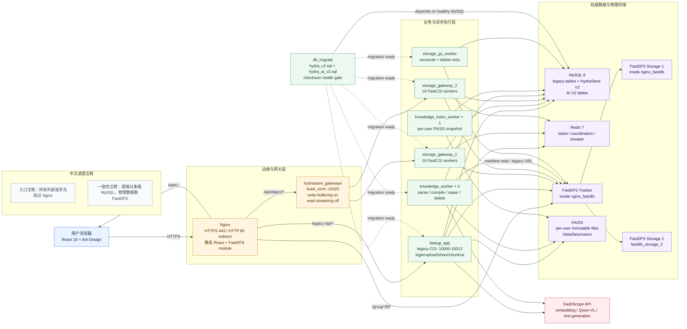
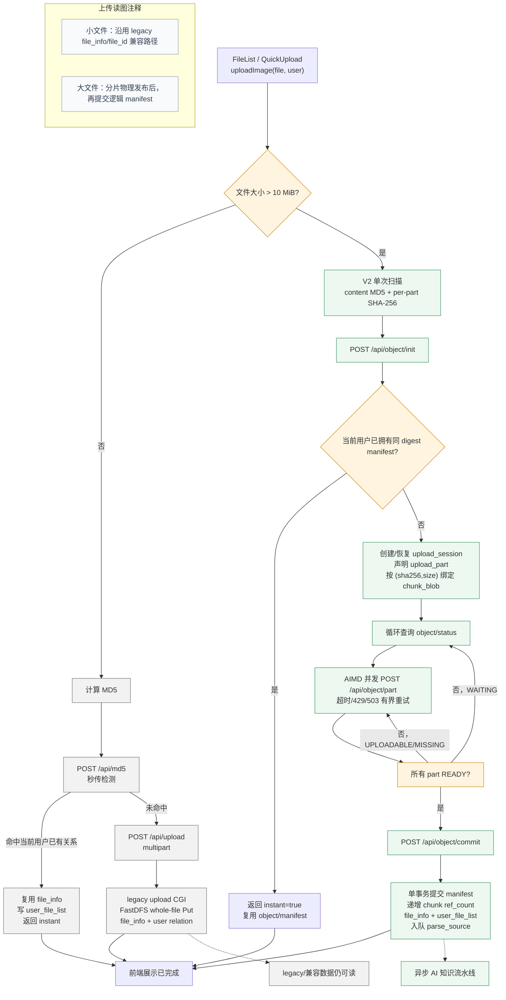
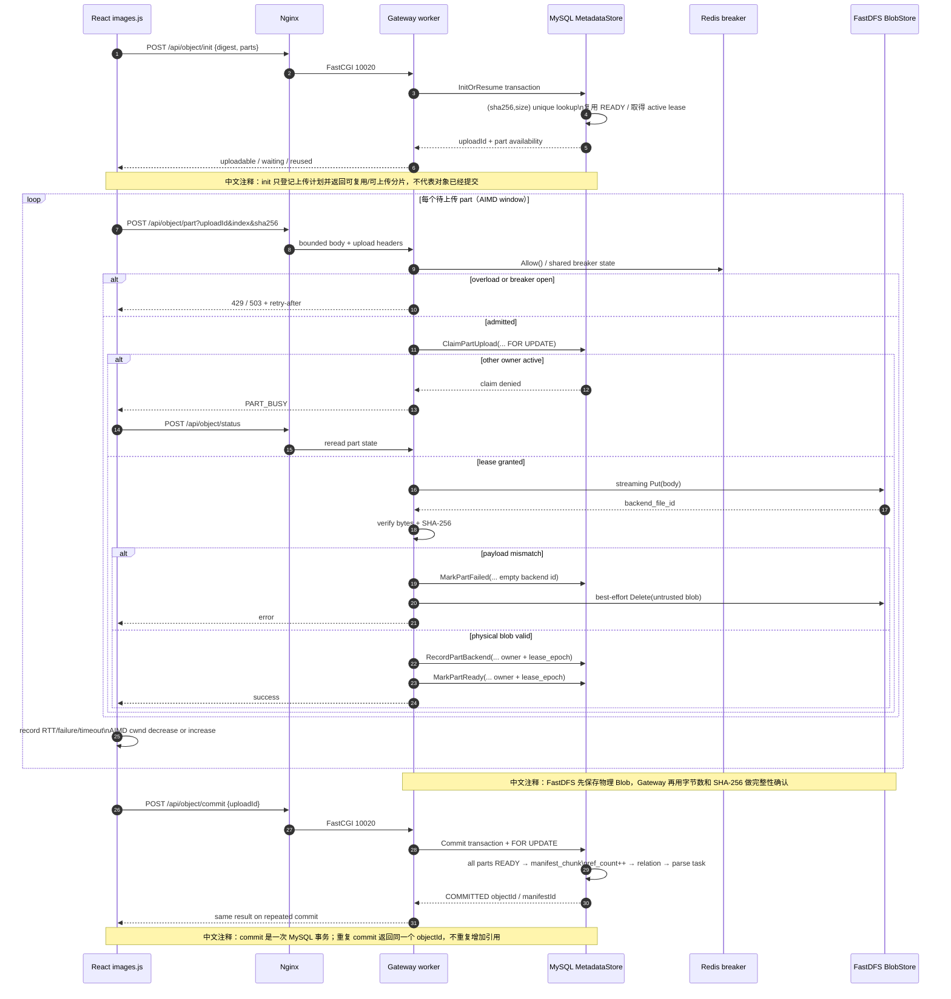
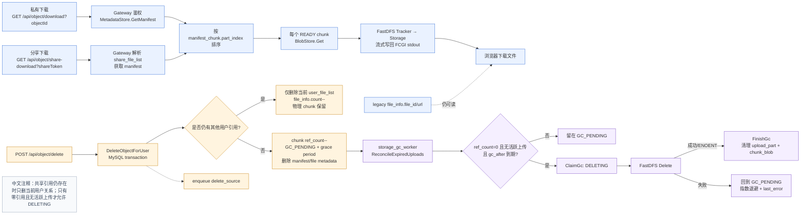
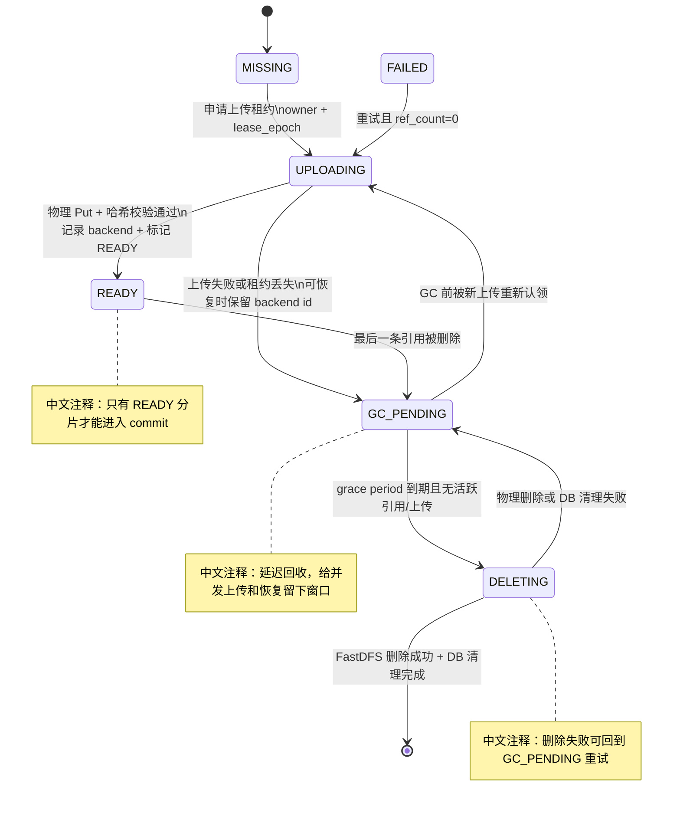
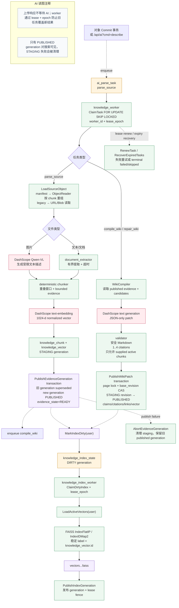
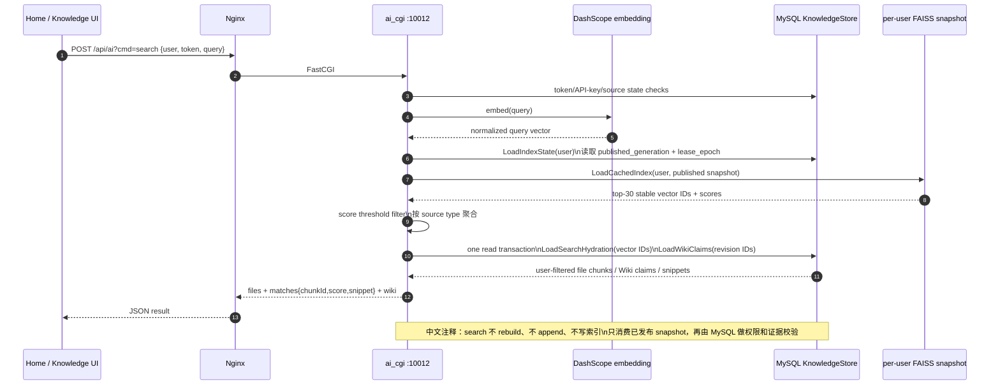
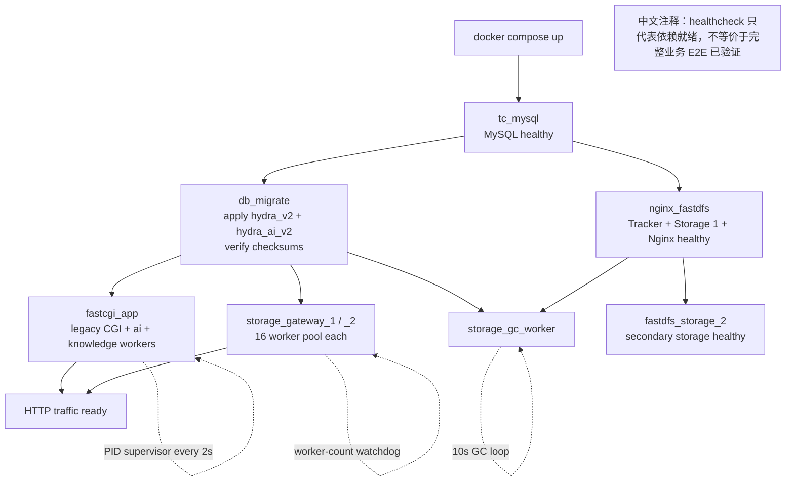

# HydraStore｜当前架构与核心 Workflow

> 这是基于当前仓库源码、Compose、SQL migration 和前端服务层生成的架构快照。
> 生成基线：`main@807c23bc833f2ec8dd0b7a33fbff27359dbeb7a3`（2026-09-06）。
> 这份图以当前实现为准；旧版 `chunked_upload.md` 中的 Appender 合并描述属于兼容链路，不是当前前端大文件主路径。

## 怎么读

- 实线表示当前主数据流；虚线表示异步触发、兼容路径或状态回写。
- V2 的逻辑对象由 MySQL manifest 管理，FastDFS 只负责 Blob 的物理读写。
- MySQL 是 upload session、manifest、chunk、reference、AI generation 和 lifecycle 的权威状态源；Redis 只承担 token、legacy 上传协同和 V2 breaker 等临时/协调状态。
- “已发布”是可见性边界：物理 Blob 先成功，再由元数据把 part/manifest/index/evidence 标为可用。

## 1. 总体架构与请求入口

### 当前边界

| 边界 | 当前职责 | 代码证据 |
| --- | --- | --- |
| Nginx | HTTPS、静态资源、legacy FastCGI 路由、V2 Gateway upstream、FastDFS 直读 | `docker/nginx_fastdfs/nginx.conf:24-42,63-80,82-360` |
| legacy FastCGI | 登录、普通上传、兼容 `chunk_*`、分享、AI HTTP 入口 | `docker/fastcgi_app/start.sh:49-91` |
| V2 Gateway | object init/part/status/commit/abort/delete/download/share-download | `src_cgi/storage_gateway.cpp:367-658` |
| MySQL | 业务关系、V2 session/manifest/chunk、AI task/evidence/wiki/index 状态 | `docker/mysql/init.sql:85-162`; `docker/mysql/hydra_ai_v2.sql:3-138` |
| FastDFS | BlobStore 的物理 `Put/Get/Delete`；不持有逻辑对象模型 | `common/storage_blob_store.cpp:66-130`; `include/storage_types.h:79-87` |
| AI worker | 解析、证据生成、Wiki 编译/修复；不阻塞上传响应 | `src_cgi/knowledge_worker.cpp:169-373` |

## 2. 用户上传总流程：小文件 legacy，大文件 V2

### 大文件 V2 part workflow（并发安全重点）

### V2 的关键不变量

1. `chunk_blob` 的唯一键 `(sha256, size)` 是物理分片去重边界；`owner_upload_id + lease_epoch` 是上传租约 fencing 边界。
2. FastDFS 物理 `Put` 成功且请求体 SHA-256 校验通过后，才允许 `RecordPartBackend`/`MarkPartReady`。
3. `Commit` 只接受所有 `upload_part.state=READY` 的 session；manifest、引用计数、用户关系和异步 `parse_source` 在一个 MySQL 事务内落地。
4. 重复 commit 对已经 `COMMITTED` 的 session 返回同一个 `objectId`，不重复增加引用。
5. 前端当前默认 AIMD 窗口为 `4..16`、初始 `8`；每个 part 有超时和最多 3 次重试。上限可由前端构建配置覆盖。

## 3. 下载、分享、删除与 GC 生命周期

### Chunk 生命周期状态机

## 4. AI Knowledge Layer：异步证据 → Wiki → 索引

### AI 状态与可见性

| 阶段 | 权威状态 | 对外行为 |
| --- | --- | --- |
| 任务排队 | `ai_parse_task.status=pending` | 上传响应不等待 AI；`describe` 返回 `queued` |
| 证据构建 | `knowledge_document.current_generation` 前进，chunk/vector 为 `STAGING` | 旧 `published_generation` 仍可读 |
| 证据发布 | chunk 为 `PUBLISHED`，document `published_generation` 更新、`evidence_state=READY` | 触发 Wiki task 和 per-user index dirty |
| 证据失败 | staging chunk/vector 删除/失活，document `FAILED` | 保留旧 published generation，不把半成品暴露给搜索 |
| 索引构建 | `knowledge_index_state=BUILDING` | 搜索继续读取旧 published snapshot |
| 索引发布 | `published_generation` 与 `published_lease_epoch` 更新 | 新搜索读取新快照 |
| Wiki 并发冲突 | page 的 `current_revision_id` 与 patch base 不一致 | 当前 task 失败/重试，不覆盖新 revision |

## 5. AI 语义搜索：只读已发布索引 + SQL hydration

## 6. 启动与依赖 workflow

## 7. 重点实现与风险边界

- **逻辑对象与物理 Blob 分离**：V2 以 `object_manifest → manifest_chunk → chunk_blob` 表达对象；FastDFS 的 `backend_file_id` 只是物理句柄。
- **MySQL 是一致性边界**：session、part、manifest、引用计数、AI generation、Wiki revision、index generation 均由 MySQL transaction + 行锁/条件更新保护。
- **Redis 不是元数据源**：V2 upload status 从 MySQL 返回；Redis 的 V2 作用主要是跨 Gateway breaker 状态，legacy 路径还保留 token/分片协同。
- **物理先行、元数据后见**：Blob 先写 FastDFS，校验通过后才标记 READY；失败 Blob 由立即清理或 GC 重试兜底。
- **共享引用安全**：删除一个用户的关系不会删除仍被其他用户引用的 chunk；只有 `ref_count=0` 且无活跃上传、经过 grace period 才进入物理删除。
- **AI 不阻塞主上传**：Commit 只在同一事务里入队 `parse_source`；解析、embedding、Wiki、FAISS 都是异步 worker。
- **搜索发布隔离**：搜索只读已发布的 per-user FAISS snapshot，MySQL hydration 再确认用户关系、source 和 citations。

## 8. 相关产物

- [交互式 HTML 图集](../../reports/architecture/hydrastore-current/architecture-workflows.html)
- [离线静态 SVG 图集](../../reports/architecture/hydrastore-current/architecture-workflows.svg)
- [节点与源码证据追踪 JSON](../../reports/architecture/hydrastore-current/architecture-workflows.json)

## 9. 证据索引

| 主题 | 主要源码锚点 |
| --- | --- |
| Compose 服务、健康依赖、双 Gateway、GC、第二存储 | `docker/docker-compose.yaml:4-232` |
| Nginx 路由、V2 upstream、buffering、failover 边界 | `docker/nginx_fastdfs/nginx.conf:24-360` |
| legacy CGI、V2 Gateway、AI worker 启动和 watchdog | `docker/fastcgi_app/start.sh:23-142` |
| 前端文件大小分流、V2 init/status/part/commit、删除/下载 | `picture_bed/src/services/images.js:149-208,444-564,566-790` |
| AIMD 窗口、RTT/失败/超时调节与重试退避 | `picture_bed/src/services/concurrency_controller.mjs:18-120` |
| V2 init、dedup、lease、part ready、commit、delete、GC | `common/storage_metadata_store.cpp:318-865` |
| Gateway part admission、breaker、streaming Put/Get、failpoint | `src_cgi/storage_gateway.cpp:367-658` |
| FastDFS BlobStore Put/Get/Delete | `common/storage_blob_store.cpp:54-143` |
| manifest 重组读取与完整性校验 | `common/storage_object_reader.cpp:81-150` |
| AI task lease、evidence generation、index state | `common/knowledge_store.cpp:172-576` |
| AI parse/embedding/Wiki task worker | `src_cgi/knowledge_worker.cpp:169-373` |
| per-user immutable FAISS build/publish | `src_cgi/knowledge_index_worker.cpp:36-101` |
| AI search、published snapshot、SQL hydration | `src_cgi/ai_cgi.cpp:256-375` |
| AI Wiki citation/CAS/publish/delete repair | `common/knowledge_store.cpp:915-1105`; `common/wiki_compiler.cpp:350-758` |
| V2 storage schema与外键/唯一约束 | `docker/mysql/init.sql:85-162`; `docker/mysql/hydra_v2.sql:12-145` |
| AI V2 schema与generation/index/task扩展 | `docker/mysql/hydra_ai_v2.sql:3-173` |

## 10. 本图未声称的内容

这是一份静态架构图，不等价于当前机器已经完成完整 Linux/Docker E2E 验证。吞吐、P99、真实多 Storage 故障恢复、DashScope smoke 和长时间 lease/GC 压测，仍应以对应测试命令和运行证据为准。
