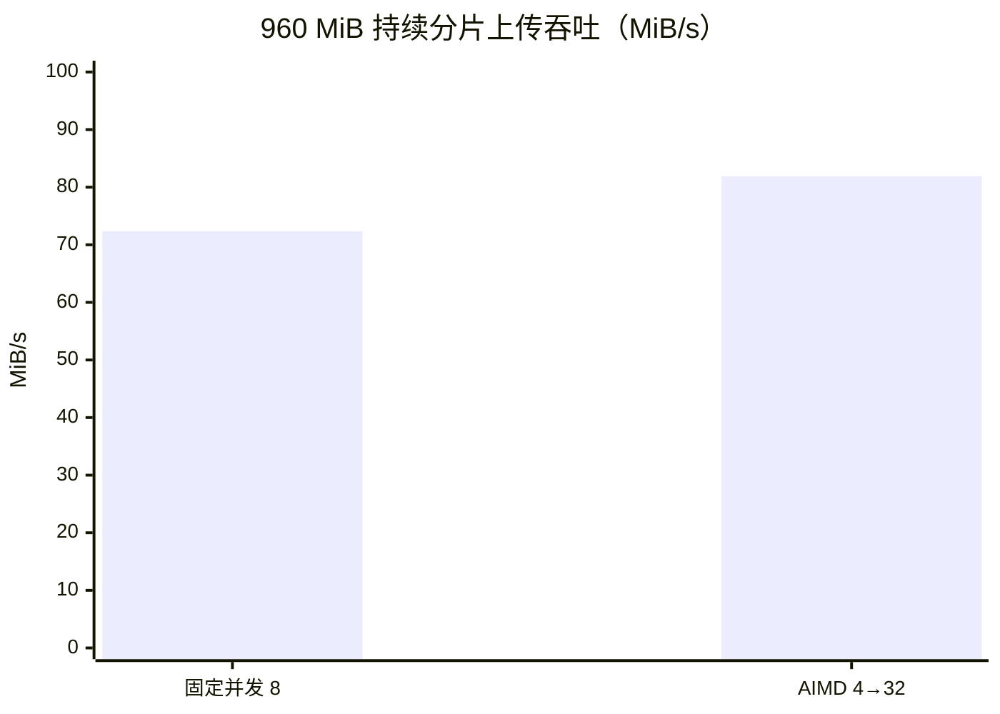

# 分片上传压测结论

> 2026-08-13，本机 Docker Desktop（16 vCPU / 6.7 GiB Docker 内存）实测。所有数据走真实 HTTPS 接口：`chunk_init → chunk_upload → chunk_merge`；绝对吞吐仅代表本机回环环境，横向对比在同一文件集、同一容器配置下完成。

## 一页结论

| 可展示指标 | 实测结果 | 结论 |
| --- | ---: | --- |
| Nginx + FastDFS 运行调优 | 固定并发吞吐 **109.52 → 129.67 MiB/s** | **+18.4%** |
| 960 MiB 持续压力下 AIMD 吞吐 | 固定 8：72.35；AIMD：**81.91 MiB/s** | **+13.2%** |
| 960 MiB 持续压力下 AIMD 峰值窗口 | **4 → 32** | 自适应窗口实际触顶 |
| 重试 / 超时 / 重传 | **0 / 0 / 0%** | 16 轮完整分片上传无失败 |
| 端到端正确性 | 初始化、分片写入、合并、入库均成功 | 真实链路验证通过 |



## 工作负载与方法

- 10 MiB / 分片；30 s 单片超时；每个文件独立 MD5，避免秒传命中。
- 固定基线：并发窗口恒为 8；AIMD：初始 4、下限 4、上限 32。
- 后端：`chunk_upload` 8 workers；每轮完成真实的 init、上传、merge。
- 每秒采样 `tc_fcgi_app`、`tc_fcgi_nginx_fastdfs`、`tc_fcgi_mysql` 的 CPU 与内存峰值。

## 运行调优前后（240 MiB，3 轮中位数）

调优项：Nginx `worker_processes 2 → auto`，FastDFS `work_threads 4 → 8`。

| 指标 | 调优前 | 调优后 | 变化 |
| --- | ---: | ---: | ---: |
| 固定并发吞吐 | 109.52 MiB/s | **129.67 MiB/s** | **+18.4%** |
| 总时长 | 2191.31 ms | **1850.82 ms** | **-15.5%** |
| P99 分片 RTT | 802.69 ms | **772.46 ms** | **-3.8%** |
| 重传率 | 0% | 0% | 持平 |

## AIMD 对照（调优后）

| 负载 | 固定并发 8 | AIMD 4→32 | AIMD 吞吐变化 | AIMD P99 RTT | 说明 |
| --- | ---: | ---: | ---: | ---: | --- |
| 240 MiB，3 轮 | 129.67 MiB/s | 128.15 MiB/s | -1.2% | 814.79 ms | 短任务尚未充分爬升窗口 |
| 960 MiB，2 轮 | 72.35 MiB/s | **81.91 MiB/s** | **+13.2%** | 3209.78 ms | 窗口爬升至 32，吞吐增加但尾延迟增大 |

## 资源峰值（960 MiB 持续压力）

| 容器 | 固定并发 CPU / 内存 | AIMD CPU / 内存 |
| --- | ---: | ---: |
| `tc_fcgi_app` | 135.18% / 151.3 MiB | 158.77% / 154.1 MiB |
| `tc_fcgi_nginx_fastdfs` | 115.06% / 81.22 MiB | 125.16% / 99.37 MiB |
| `tc_fcgi_mysql` | 3.74% / 459.1 MiB | 10.13% / 461.9 MiB |

## 如实解释

- 这次实测不足以支持“吞吐提升 30%、超时重传降低 40%”的固定表述：本机环境没有产生超时或重传，且 AIMD 在 960 MiB 长任务中的真实吞吐提升为 **13.2%**。
- 可用于简历/答辩的准确表述是：**“在 Docker 回环压力环境中，针对 960 MiB 持续分片上传，AIMD 并发窗口从 4 自适应增长至 32，实测吞吐较固定并发 8 提升 13.2%，全程 0 超时、0 重传；同时识别出 P99 分片 RTT 上升，需要按网络质量设置并发上限。”**
- 若目标是继续提高吞吐且控制尾延迟，下一轮应在注入网络抖动或跨主机链路下，分别扫描 AIMD 上限 12 / 16 / 24 / 32，而不是直接宣传当前未测出的 30%。

## 可复现命令

```powershell
node scripts/benchmark_chunk_upload.mjs --trials=3 --chunks=24 --chunk-mib=10
node scripts/benchmark_chunk_upload.mjs --trials=2 --chunks=96 --chunk-mib=10
```

逐轮原始数据：

- `chunk-upload-benchmark-2026-08-13T04-24-59-067Z.json`：调优前 240 MiB。
- `chunk-upload-benchmark-2026-08-13T04-27-53-283Z.json`：调优后 240 MiB。
- `chunk-upload-benchmark-2026-08-13T04-29-23-828Z.json`：调优后 960 MiB。
