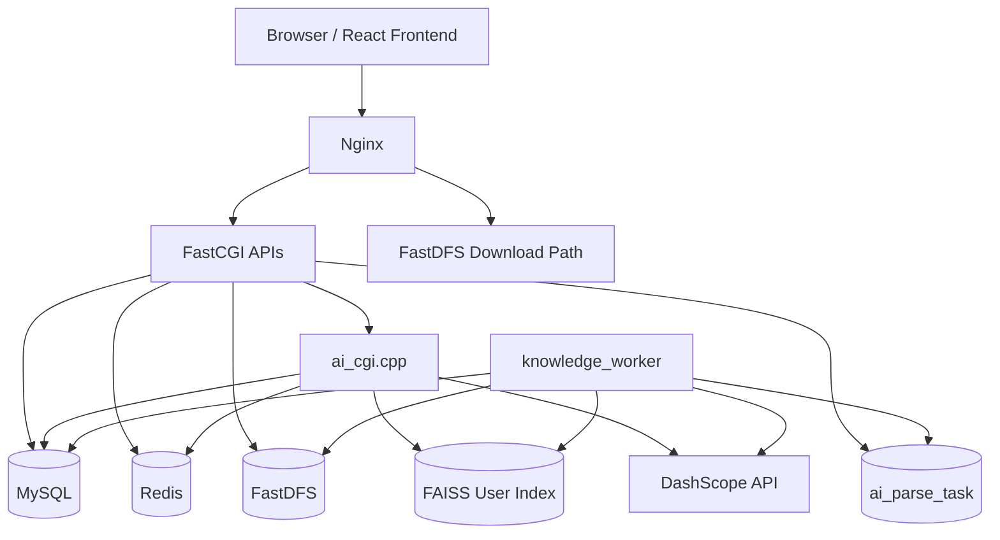
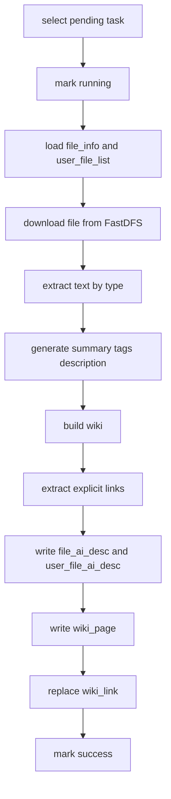

# 技术文档：分布式双链知识云存储系统

## 1. 文档目的

本文档是 [dual_link_knowledge_cloud_storage_prd.md](./dual_link_knowledge_cloud_storage_prd.md) 的技术落地版本，目标不是重新定义产品边界，而是把 PRD 中已经确定的 MVP 范围转换成可执行的工程方案，供后续模型或开发者直接按步骤实现。

本技术文档优先满足三个要求：

1. **不改变底层架构形态。**
   继续基于当前 `Nginx + FastCGI + C/C++ + MySQL + Redis + FastDFS + React`。
2. **优先复用现有能力。**
   现有文件上传、秒传、分片上传、分享、AI 描述、语义搜索、FAISS 索引能力都应尽量复用。
3. **先做最小闭环。**
   先把 `AI 文件卡片 + 文件级 Wiki + 显式双链 + 反向链接 + 可解释搜索` 做通，再考虑轻量关系图、Wiki 分享、独立任务中心。

---

## 2. 当前基线

### 2.1 已有能力

当前仓库已经具备以下基础：

- 云盘底座：上传、下载、秒传、分享、删除、排行榜。
- 大文件能力：分片上传、断点续传。
- AI 能力：文件描述生成、语义搜索、FAISS 用户私有索引。
- 前端能力：React 18 页面、首页 AI 搜索入口、文件列表、共享列表等。

可确认的现有模块：

- 后端 FastCGI 模块：
  - `/api/upload`
  - `/api/md5`
  - `/api/myfiles`
  - `/api/dealfile`
  - `/api/sharefiles`
  - `/api/dealsharefile`
  - `/api/sharepic`
  - `/api/chunk_init`
  - `/api/chunk_upload`
  - `/api/chunk_merge`
  - `/api/ai`
- AI 现状：
  - `describe`
  - `search`
  - `rebuild`
- AI 缓存表现状：
  - `file_ai_desc`：全局缓存
  - `user_file_ai_desc`：用户侧 AI 检索记录

### 2.2 已有数据模型

当前核心表：

- `user_info`
- `file_info`
- `user_file_list`
- `user_file_count`
- `share_file_list`
- `file_ai_desc`
- `user_file_ai_desc`

当前 AI 层已经具备“全局缓存 + 用户私有记录”的双层结构，这正好可以复用于知识层：

```text
同一物理文件
  → 可共享全局解析结果
  → 但用户可见知识视图默认按用户隔离
```

### 2.3 当前能力与目标能力之间的差距

当前更像：

```text
云盘 + AI 描述 + 语义搜索
```

目标 MVP 是：

```text
云盘 + AI 文件卡片 + 文件级 Wiki + 显式双链 + 反向链接 + 可解释搜索
```

因此本次技术工作本质上是在现有 `ai_cgi.cpp + file_ai_desc + user_file_ai_desc` 之上，补齐：

1. 异步解析任务
2. Wiki 数据结构
3. 双链关系结构
4. 文件级状态展示
5. 搜索解释与相关文件

---

## 3. 核心技术决策

### 3.1 决策一：不新增独立微服务，继续沿用 FastCGI 架构

**选择：**

- 保持当前 Nginx + 多 FastCGI 进程模式。
- 读取类能力优先扩展现有 `ai_cgi.cpp`。
- 新增长耗时任务通过“后台 worker 进程”实现，而不是把解析逻辑塞进上传接口。

**原因：**

- 当前仓库已经围绕 FastCGI、Nginx 路由、Docker 启动脚本构建完成。
- 如果现在改为单独 HTTP 服务或消息队列系统，工程收益不如改造成本高。
- 复用 `ai_cgi.cpp` 能减少 Nginx 路由、端口、前端 API 层的大改动。

**结论：**

- `ai_cgi.cpp` 继续承担知识读取和搜索能力。
- 新增 `knowledge_worker` 进程承担异步解析。

### 3.2 决策二：知识层默认按用户隔离，但可复用全局解析缓存

**选择：**

- 物理文件按 `md5` 去重，继续复用 `file_info`。
- AI 原始解析结果可以在全局缓存层复用。
- 用户可见的文件卡片、Wiki、双链、反向链接、搜索视图默认按用户隔离。

**原因：**

- 当前系统已经存在 `file_ai_desc` 与 `user_file_ai_desc` 双层结构。
- 这样既能减少重复消耗 token，又不会把不同用户的知识空间混在一起。

### 3.3 决策三：MVP 不做完整图谱，只做显式双链和反向链接

**选择：**

- MVP 不做独立图谱页。
- 只做：
  - Markdown 中 `[[concept]]` 显式双链解析
  - `wiki -> concept` 关系存储
  - 反向链接查询

**原因：**

- 这已经足够支持“Obsidian-style 双链”亮点。
- 复杂图谱会显著扩大 schema、接口、前端可视化和删除一致性成本。

### 3.4 决策四：上传成功即入库，解析失败不影响文件服务

**选择：**

- 上传成功只表示文件存储主链路成功。
- AI 解析异步进行，失败只影响知识层，不影响文件可见、可下载、可分享。

**原因：**

- 保持当前云盘底座稳定。
- 避免 AI 服务不可用导致上传主链路失败。

---

## 4. 目标架构

### 4.1 总体架构图



### 4.2 组件职责

#### Nginx

- 继续承担静态资源、FastCGI 路由、FastDFS 文件下载。
- 无需为 MVP 新增大量路由，优先复用已有 `/api/ai`。

#### 现有 FastCGI 模块

- `upload_cgi.c` / `md5_cgi.c`
  - 上传成功或秒传命中后，负责创建解析任务。
- `myfiles_cgi.c`
  - 文件列表返回时补充解析状态字段。
- `dealfile_cgi.c`
  - 删除文件时同步清理用户侧知识记录或标记失效。

#### ai_cgi.cpp

继续承担知识读取与搜索类命令，包括：

- 已有：
  - `describe`
  - `search`
  - `rebuild`
- 新增建议：
  - `file_card`
  - `wiki`
  - `backlinks`
  - `related`

#### knowledge_worker

新增后台进程，职责：

- 轮询 `ai_parse_task`
- 下载或读取目标文件
- 执行内容抽取
- 生成摘要、标签、描述
- 生成 / 更新 Wiki
- 解析显式双链
- 写入用户知识记录
- 更新任务状态

---

## 5. 模块设计

### 5.1 后端模块拆分

建议新增或调整的代码职责如下：

#### 现有模块修改

- `src_cgi/upload_cgi.c`
  - 上传成功后触发 `enqueue_parse_task(user, md5, type, source=upload)`
- `src_cgi/md5_cgi.c`
  - 秒传成功后触发 `enqueue_parse_task(user, md5, type, source=md5_hit)`
- `src_cgi/myfiles_cgi.c`
  - 在文件列表中返回 `parse_status`
- `src_cgi/dealfile_cgi.c`
  - 删除用户文件时清理用户侧 Wiki / link / user knowledge 记录
- `src_cgi/ai_cgi.cpp`
  - 增加知识读取命令
  - 增强搜索返回结构

#### 建议新增公共模块

- `common/knowledge_task.c` / `include/knowledge_task.h`
  - 任务入队
  - 任务状态更新
  - 重试计数
- `common/wiki_builder.cpp` / `include/wiki_builder.h`
  - 摘要、标签、Wiki 组装
  - 显式双链提取
- `common/file_parser.cpp` / `include/file_parser.h`
  - `txt/md/code` 读取
  - `pdf` 文本抽取
- `common/knowledge_cleanup.c` / `include/knowledge_cleanup.h`
  - 删除文件后的知识层清理

#### 建议新增进程

- `src_cgi/knowledge_worker.cpp`
  - 非 FastCGI 进程
  - 启动后常驻轮询任务表

### 5.2 前端模块拆分

建议新增或调整：

- `picture_bed/src/services/ai.js`
  - 增加：
    - `fetchFileCard(md5, user)`
    - `fetchWiki(md5, user)`
    - `fetchBacklinks(md5, user)`
    - `fetchRelated(md5, user)`
- `picture_bed/src/pages/FileList.js`
  - 展示 `parse_status`
  - 增加“查看 Wiki”按钮
- `picture_bed/src/pages/Home.js`
  - 搜索结果增加 `reason`
  - 支持跳转到 Wiki
- 建议新增：
  - `picture_bed/src/pages/WikiDetail.js`
    - 展示摘要、标签、内容块、概念链接、反向链接、相关文件

---

## 6. 数据模型设计

## 6.1 设计原则

- 尽量复用现有 `file_ai_desc` 和 `user_file_ai_desc`
- 把“全局缓存”和“用户可见知识层”继续分离
- MVP 只为 Wiki 和双链增加最少必要表

### 6.2 现有表复用策略

#### `file_ai_desc`

作用保持为：

- 全局解析缓存
- 按 `md5` 去重
- 可复用给多个用户

建议扩展字段：

```sql
ALTER TABLE file_ai_desc
ADD COLUMN summary TEXT NULL,
ADD COLUMN tags_json TEXT NULL,
ADD COLUMN outline_json LONGTEXT NULL,
ADD COLUMN parser_version VARCHAR(32) DEFAULT 'v1',
ADD COLUMN updated_at DATETIME DEFAULT CURRENT_TIMESTAMP ON UPDATE CURRENT_TIMESTAMP;
```

#### `user_file_ai_desc`

作用升级为：

- 用户私有文件卡片
- 用户私有搜索记录
- 用户私有解析状态入口

建议扩展字段：

```sql
ALTER TABLE user_file_ai_desc
ADD COLUMN summary TEXT NULL,
ADD COLUMN tags_json TEXT NULL,
ADD COLUMN parse_status VARCHAR(32) DEFAULT 'pending',
ADD COLUMN error_msg TEXT NULL,
ADD COLUMN updated_at DATETIME DEFAULT CURRENT_TIMESTAMP ON UPDATE CURRENT_TIMESTAMP;
```

### 6.3 新增表

#### 6.3.1 `ai_parse_task`

用途：

- 管理异步解析任务
- 支持重试和状态展示

```sql
CREATE TABLE IF NOT EXISTS ai_parse_task (
    id BIGINT PRIMARY KEY AUTO_INCREMENT,
    user VARCHAR(32) NOT NULL,
    md5 VARCHAR(256) NOT NULL,
    task_type VARCHAR(32) NOT NULL DEFAULT 'parse_file',
    source VARCHAR(32) NOT NULL DEFAULT 'upload',
    status VARCHAR(32) NOT NULL DEFAULT 'pending',
    retry_count INT NOT NULL DEFAULT 0,
    error_msg TEXT NULL,
    worker_id VARCHAR(64) NULL,
    created_at DATETIME DEFAULT CURRENT_TIMESTAMP,
    updated_at DATETIME DEFAULT CURRENT_TIMESTAMP ON UPDATE CURRENT_TIMESTAMP,
    KEY idx_user_status (user, status),
    KEY idx_md5_status (md5(191), status)
);
```

#### 6.3.2 `wiki_page`

用途：

- 存储用户私有文件级 Wiki

```sql
CREATE TABLE IF NOT EXISTS wiki_page (
    id BIGINT PRIMARY KEY AUTO_INCREMENT,
    user VARCHAR(32) NOT NULL,
    md5 VARCHAR(256) NOT NULL,
    title VARCHAR(255) NOT NULL,
    summary TEXT NULL,
    tags_json TEXT NULL,
    outline_json LONGTEXT NULL,
    status VARCHAR(32) NOT NULL DEFAULT 'active',
    created_at DATETIME DEFAULT CURRENT_TIMESTAMP,
    updated_at DATETIME DEFAULT CURRENT_TIMESTAMP ON UPDATE CURRENT_TIMESTAMP,
    UNIQUE KEY uq_user_md5 (user, md5(191)),
    KEY idx_user_status (user, status)
);
```

#### 6.3.3 `wiki_link`

用途：

- 存储显式双链和反向链接关系

```sql
CREATE TABLE IF NOT EXISTS wiki_link (
    id BIGINT PRIMARY KEY AUTO_INCREMENT,
    user VARCHAR(32) NOT NULL,
    src_md5 VARCHAR(256) NOT NULL,
    dst_name VARCHAR(255) NOT NULL,
    link_type VARCHAR(32) NOT NULL DEFAULT 'explicit',
    anchor_text VARCHAR(255) NULL,
    created_at DATETIME DEFAULT CURRENT_TIMESTAMP,
    UNIQUE KEY uq_user_src_dst_type (user, src_md5(191), dst_name, link_type),
    KEY idx_user_dst (user, dst_name),
    KEY idx_user_src (user, src_md5(191))
);
```

### 6.4 为什么不直接上 `kg_node / kg_edge`

因为 MVP 只需要：

- 从 Wiki 中解析显式概念
- 查询“哪些文件引用了这个概念”

这用 `wiki_link` 就能闭环。
如果后续要做轻量关系图，再从 `wiki_link` 平滑升级到 `kg_node / kg_edge`。

---

## 7. API 设计

## 7.1 总体策略

为降低改动成本，推荐复用已有：

```text
POST /api/ai?cmd=...
```

不在 MVP 内新开 `/api/wiki`、`/api/task`、`/api/graph` 多路由。

### 7.2 新增命令

#### 7.2.1 `cmd=file_card`

用途：

- 获取文件卡片

请求：

```json
{
  "user": "alice",
  "token": "xxx",
  "md5": "yyy"
}
```

返回：

```json
{
  "code": 0,
  "data": {
    "md5": "yyy",
    "parse_status": "success",
    "summary": "......",
    "tags": ["FastDFS", "分布式存储", "上传链路"],
    "description": "......",
    "wiki_ready": true
  }
}
```

#### 7.2.2 `cmd=wiki`

用途：

- 获取文件级 Wiki

返回：

```json
{
  "code": 0,
  "data": {
    "title": "FastDFS 架构分析",
    "summary": "......",
    "tags": ["FastDFS", "存储"],
    "outline": [
      "1. 基本架构",
      "2. Tracker 调度",
      "3. Storage 写入"
    ],
    "links": ["Tracker", "Storage", "Nginx"],
    "source": {
      "md5": "yyy",
      "filename": "fastdfs_notes.md"
    }
  }
}
```

#### 7.2.3 `cmd=backlinks`

用途：

- 获取当前文件涉及概念的反向引用

返回：

```json
{
  "code": 0,
  "data": [
    {
      "concept": "FastDFS",
      "referenced_by": [
        {"md5": "a1", "filename": "云存储设计.md"},
        {"md5": "a2", "filename": "分布式文件系统对比.md"}
      ]
    }
  ]
}
```

#### 7.2.4 `cmd=related`

用途：

- 获取相关文件

返回：

```json
{
  "code": 0,
  "data": [
    {
      "md5": "z1",
      "filename": "对象存储笔记.md",
      "reason": "标签重合：分布式存储, 文件系统"
    },
    {
      "md5": "z2",
      "filename": "FastDFS 上传链路.pdf",
      "reason": "语义相似度 0.82"
    }
  ]
}
```

### 7.3 搜索返回结构增强

当前 `search` 返回结果可扩展为：

```json
{
  "code": 0,
  "count": 2,
  "files": [
    {
      "md5": "xxx",
      "filename": "fastdfs_notes.md",
      "description": "......",
      "summary": "......",
      "tags": ["FastDFS", "分布式存储"],
      "score": 0.87,
      "reason": "语义相似度 0.87；标签命中：FastDFS"
    }
  ]
}
```

### 7.4 文件列表返回结构增强

`/api/myfiles` 返回项建议增加：

- `parse_status`
- `wiki_ready`

这样前端文件列表能直接显示：

- 解析中
- 解析成功
- 解析失败
- 可查看 Wiki

---

## 8. 异步任务设计

### 8.1 任务触发时机

以下两种场景都应创建任务：

1. 普通上传成功
2. 秒传命中成功，但当前用户没有知识层记录

### 8.2 任务状态机

```text
pending
  → running
  → success
  → failed
  → skipped
```

重试规则：

```text
failed
  → retry_count + 1
  → retry_count < 3 时回到 pending
  → retry_count >= 3 时保持 failed
```

### 8.3 Worker 处理流程



### 8.4 文件解析策略

#### 文本类

- `txt`
- `md`
- `cpp/h/c/py/java/js/ts`

处理方式：

- 直接读取文本内容

#### PDF

推荐方案：

- 在 `fastcgi_app` 容器内安装 `pdftotext`
- worker 下载 PDF 到临时目录后执行文本抽取

原因：

- 比引入复杂 PDF SDK 成本低
- 对 MVP 足够

### 8.5 显式双链提取

提取规则：

```regex
\[\[([^\[\]]+)\]\]
```

示例：

```text
本项目使用 [[FastDFS]] 作为底层存储，并使用 [[FAISS]] 实现语义搜索。
```

提取结果：

- `FastDFS`
- `FAISS`

写入：

- `wiki_link(user, src_md5, dst_name, link_type='explicit')`

### 8.6 相关文件生成策略

MVP 不做复杂混排，按以下优先级返回最多 3 条：

1. 显式双链重合
2. 标签重合
3. 语义相似度

理由说明格式：

- `标签重合：FastDFS, 分布式存储`
- `语义相似度 0.82`
- `共享概念：FAISS`

---

## 9. 删除与一致性处理

### 9.1 删除用户文件时的知识层清理

删除用户文件时：

1. 删除或软删除 `user_file_ai_desc`
2. 删除对应 `wiki_page`
3. 删除 `wiki_link` 中 `src_md5 = 当前 md5 and user = 当前 user` 的记录
4. 标记用户侧索引脏状态，等待下次 `search/rebuild` 时重建

### 9.2 为什么不立即删 `file_ai_desc`

因为：

- `file_ai_desc` 是全局解析缓存
- 其他用户可能仍然持有同一物理文件
- 即使引用计数归零，也可以允许全局缓存残留，不影响主链路

### 9.3 索引更新策略

继续沿用当前思路：

- 普通新增：增量追加
- 缓存同步：批量补录
- 删除后：打脏标记
- 下次搜索或显式重建时：全量 rebuild

---

## 10. 实施步骤

## 10.1 总体顺序

建议严格按下面顺序推进，避免先做页面再补后端：

1. 数据库变更
2. 公共模块抽取
3. 任务入队
4. worker 实现
5. `ai_cgi.cpp` 读取命令扩展
6. 文件列表状态增强
7. 前端 Wiki 与搜索结果增强
8. 删除链路清理
9. 集成验证

## 10.2 分步骤实施

### Step 1：数据库 schema 变更

目标：

- 新增 `ai_parse_task`
- 新增 `wiki_page`
- 新增 `wiki_link`
- 扩展 `file_ai_desc`
- 扩展 `user_file_ai_desc`

主要文件：

- `docker/mysql/init.sql`

完成标志：

- 容器重建后表可正常创建
- 不影响旧表初始化

### Step 2：抽取知识层公共模块

目标：

- 抽出任务模块、Wiki 构建模块、文件解析模块

建议文件：

- `common/knowledge_task.c`
- `include/knowledge_task.h`
- `common/wiki_builder.cpp`
- `include/wiki_builder.h`
- `common/file_parser.cpp`
- `include/file_parser.h`

完成标志：

- 能独立编译通过
- 工具函数可被 `upload/md5/worker/ai_cgi` 复用

### Step 3：在上传与秒传链路中入队

目标：

- 文件上传成功后自动写入 `ai_parse_task`
- 秒传成功但用户无知识记录时也入队

主要文件：

- `src_cgi/upload_cgi.c`
- `src_cgi/md5_cgi.c`

完成标志：

- 正常上传后数据库出现 `pending` 任务
- 秒传场景也可补任务

### Step 4：实现后台 knowledge_worker

目标：

- 后台轮询任务表
- 完成文件解析与 Wiki 构建

建议文件：

- `src_cgi/knowledge_worker.cpp`
- `docker/fastcgi_app/start.sh`
- `Makefile`
- `docker/fastcgi_app/dockerfile`

完成标志：

- worker 可在容器内启动
- 任务能从 `pending` 变为 `success/failed/skipped`

### Step 5：扩展 ai_cgi.cpp 读取能力

目标：

- 支持 `file_card`
- 支持 `wiki`
- 支持 `backlinks`
- 支持 `related`
- 增强 `search` 返回的 `reason/summary/tags`

主要文件：

- `src_cgi/ai_cgi.cpp`

完成标志：

- 新命令能返回结构化 JSON
- 搜索结果包含 `reason`

### Step 6：文件列表补充解析状态

目标：

- `/api/myfiles` 返回 `parse_status`
- 支持前端展示“解析中 / 成功 / 失败 / 跳过”

主要文件：

- `src_cgi/myfiles_cgi.c`

完成标志：

- 文件列表中每条记录都带状态

### Step 7：前端接入 Wiki 与搜索解释

目标：

- 文件列表显示状态与 Wiki 入口
- 搜索结果展示 `reason`
- 新增 Wiki 页面

主要文件：

- `picture_bed/src/services/ai.js`
- `picture_bed/src/pages/Home.js`
- `picture_bed/src/pages/FileList.js`
- `picture_bed/src/App.js`
- `picture_bed/src/pages/WikiDetail.js`

完成标志：

- 用户可以从搜索和文件列表进入 Wiki
- 搜索结果能看到命中原因

### Step 8：删除链路清理知识层

目标：

- 删除文件后清理用户知识记录与 Wiki
- 保持索引一致性

主要文件：

- `src_cgi/dealfile_cgi.c`
- `common/knowledge_cleanup.c`

完成标志：

- 删除后不会再查到已删文件的 Wiki 和反向链接

### Step 9：集成验证

目标：

- 跑通上传 → 解析 → Wiki → 搜索 → 反向链接 闭环

完成标志：

- Demo 脚本可一次走通

---

## 11. 验证步骤

### 11.1 基础闭环验证

1. 登录系统
2. 上传一个 `md/txt/pdf` 文件
3. 在文件列表中看到 `parse_status=pending/running`
4. 等待状态变为 `success`
5. 打开文件详情，看到摘要、标签、Wiki 入口
6. 进入 Wiki 页面，看到标题、摘要、标签、内容块
7. 如果文件包含 `[[FastDFS]]`，查看到显式链接
8. 打开反向链接，看到引用该概念的其他文件
9. 在首页使用自然语言搜索，看到 `reason`

### 11.2 秒传验证

1. 用户 A 上传文件并完成解析
2. 用户 B 上传相同文件，命中秒传
3. 验证：
   - 不重复写物理文件
   - 用户 B 仍能生成或继承自己的知识层记录
   - 不额外消耗 AI token 时仍能完成基本文件卡片

### 11.3 失败验证

1. 人为关闭 AI 能力或制造解析失败
2. 上传文件
3. 验证：
   - 文件仍上传成功
   - 状态展示为 `failed`
   - 搜索与 Wiki 不影响其他文件

### 11.4 删除验证

1. 删除一个已完成解析的文件
2. 验证：
   - 文件列表消失
   - Wiki 不可访问
   - 反向链接中不再出现该文件
   - 后续搜索不会继续返回该文件

---

## 12. 风险与规避

### 风险 1：worker 引入后容器进程管理变复杂

规避：

- 在 `docker/fastcgi_app/start.sh` 中明确启动顺序
- worker 单独打日志
- 不和 FastCGI 混在同一 accept 循环

### 风险 2：PDF 文本抽取质量不稳定

规避：

- 首版只保证“能抽到文本则生成 Wiki”
- 抽取失败时降级为只生成最小文件卡片

### 风险 3：删除后 Wiki / backlink 脏数据

规避：

- 删除时做用户侧同步清理
- 对索引使用脏标记重建

### 风险 4：搜索返回对象过多，前端改动范围失控

规避：

- MVP 搜索主返回对象只保留文件结果
- Wiki 只作为附加跳转入口

---

## 13. 建议给 DeepSeek 的执行边界

如果后续把 PRD 和本技术文档交给 DeepSeek，建议明确以下边界：

1. **不要改底层架构。**
   不要把 FastCGI 改成全新服务框架。
2. **先做 MVP，不要顺手实现关系图。**
   轻量关系图明确是后续增强项。
3. **优先复用现有 `file_ai_desc` / `user_file_ai_desc`。**
   不要上来就推翻现有 AI 缓存设计。
4. **搜索主返回对象先保持文件结果。**
   不要第一版就做 file/wiki/concept 混合结果排序。
5. **把任务系统做轻。**
   用 MySQL 任务表轮询即可，不要先引入 MQ。
6. **确保删除链路做干净。**
   否则最容易留下脏 Wiki 和脏反向链接。

---

## 14. 后续文档建议

如果需要继续细化，建议按以下顺序补文档：

1. `schema.md`
   - 精确字段定义
   - 状态枚举
   - JSON 结构
2. `api-contracts.md`
   - 每个接口请求响应示例
   - 错误码
3. `test-cases.md`
   - 正常、异常、边界用例

当前阶段，这份 `tech-spec.md` 已足够作为下一步实现的主执行文档。
